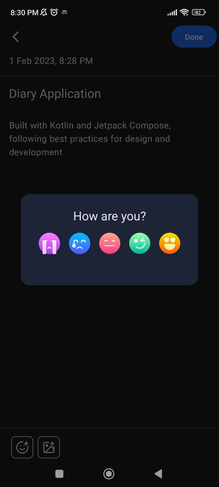
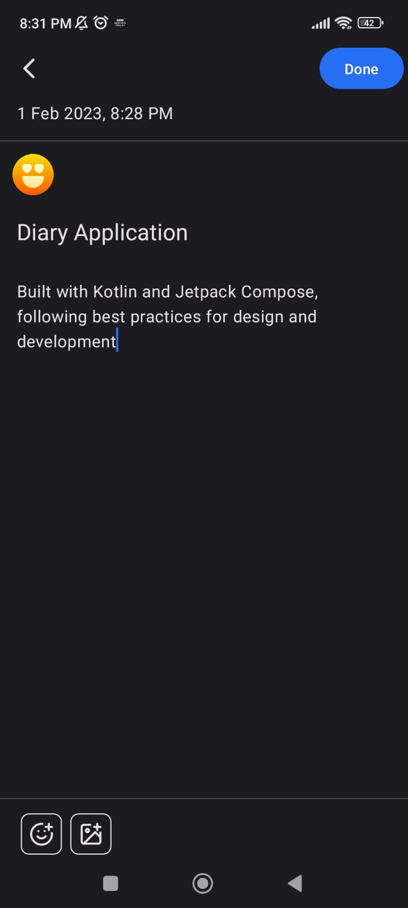
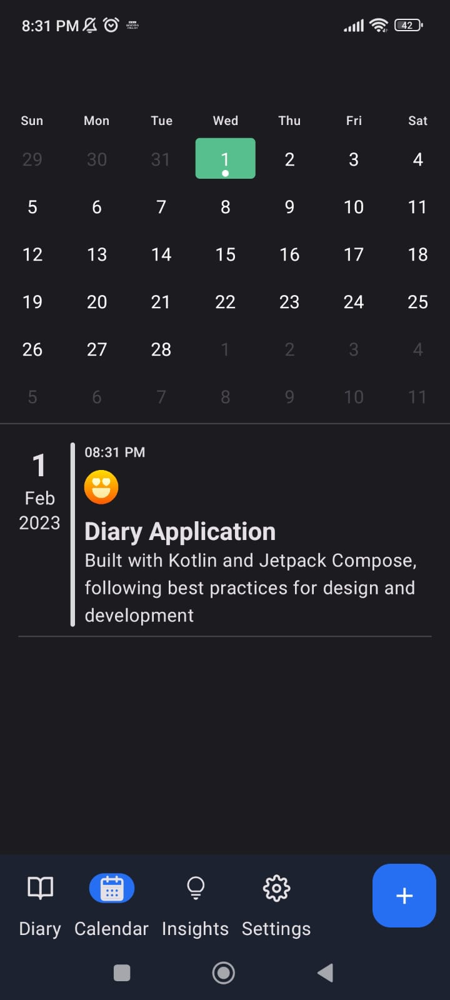
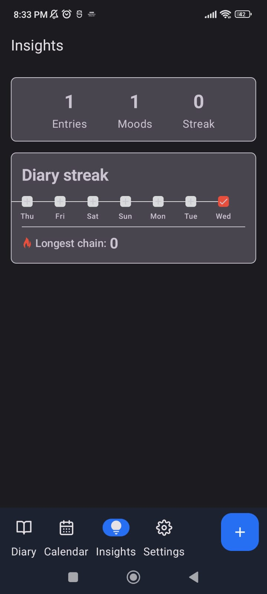
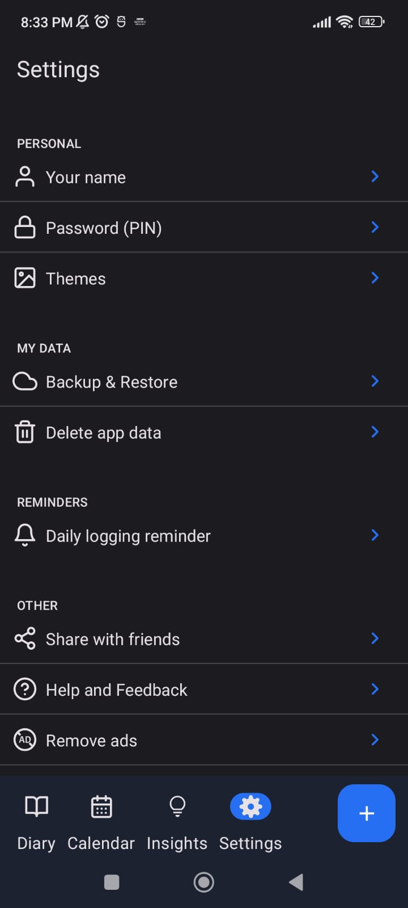

## Diary Application
An Android application built with Kotlin and Jetpack Compose, following best practices for design and development.

## Features
* Add, delete, and update diary entries
* View entries by date using the calendar view
* See diary statistics, such as streak and longest entry chain, in the insights tab
* Change the theme of the app to personalize your experience

## 📷 Previews

<p align="center">


</br>



</p>

## Architecture
The application is built with a multi-module architecture, with the presentation module following the MVVM design pattern.

## Libraries Used
* Jetpack Compose for building the UI
* MVVM for the presentation architecture
* DataStore for storing user preferences
* Room db for managing the diary entries database

## Try it out
Clone the repository and build the application on your local machine. Make sure you have the latest version of Android Studio and the Android SDK installed.

```git
  git clone https://github.com/username/diary-app.git
```
Open the project in Android Studio and run the app on an emulator or connected device.


## Contributions
Feel free to fork the repository and make any changes you'd like. If you would like to contribute to the project, please open a pull request with your proposed changes.
